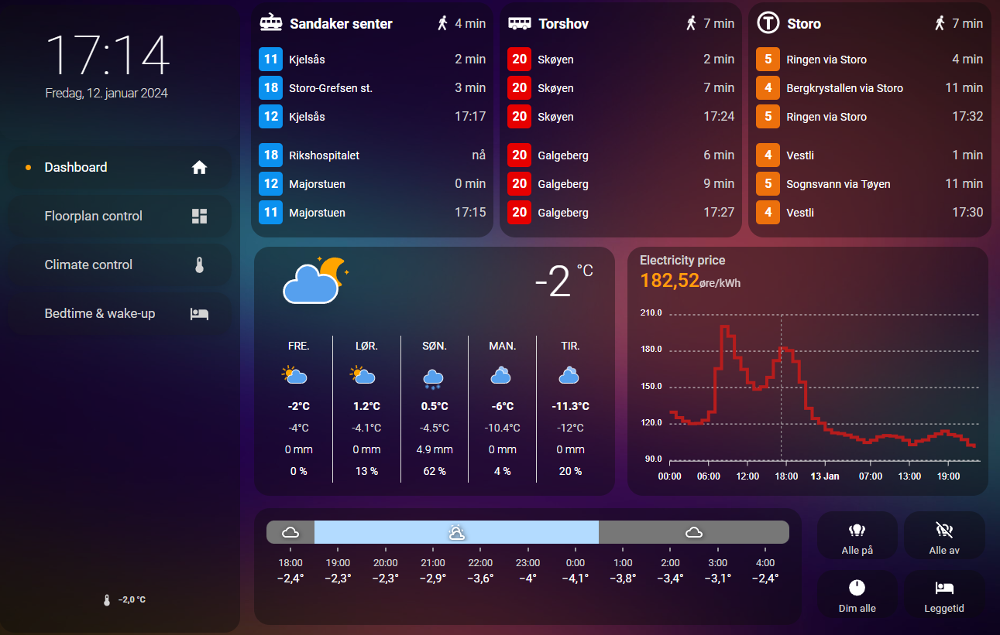

# Home Assistant // Gullburet

This repo contains (the shareable part of) my smart-home configuration. Orchestration is handled by [Home Assistant](https://www.home-assistant.io/). 

What is *Gullburet*? It's the nickname of our apartment, and it means "the gold-cage".

## Hardware

The system is compromised of many hardware devices, obviously. 

### Host system
- Raspberry Pi 4 model B 2GB
- OS: Home Assistant OS
- PSU: 5V/3A USB-C
- Storage: Kingston KC600 256GB SSD, connected to RPi with SATA-to-USB3 adapter
- Network: CAT-6 network cable and Wi-Fi to router
- USB: ConBee II Stick (as Zigbee-controller)
- USB: Aeotec Z-Stick 7 (as Z-Wave-controller)

### Router
Asus RT-AC88U

### Wi-Fi/Network Devices
- Heating: **Mill Heat** (panel heaters, movable floor-unit)
- Lights: **Philips Hue** (bulbs, switches, sensors)(actually Zigbee, but on its own network)
- Speakers: **Sonos** (Play:1, One, Beam)
- Robot vacuum: **Roborock** S7 Plus
- TV: **Samsung** The Frame 55"
- Tablet, wall-mounted dashboard: **Lenovo** Tab M10 FHD Plus
- **Shelly** Plug Plus S

### Z-Wave Devices
- **Fibaro** Dimmer Switch 2, Switch 2
- **Heat-it** Z-TRM3 Thermostat for floor heating

### Zigbee Devices
- **IKEA** TRÅDFRI: Transformers, lightbulbs, sockets, switches
- **Aqara** Temperature & Humidity T1 sensors
- **Namron** Temperature & Humidity sensors. Wall-mounted panel heater.

#### Tips on deploying a Zigbee network

- Use only one application to control the Zigbee-network. With the ConBee II-stick on Home Assistant there were mainly three options I considered: **ZHA**, **deCONZ** and **Zigbee2MQTT**. I chose ZHA because it is compatible with the intended devices, and it is really easy to add devices from the HA interface. [Check the compatibility list for Zigbee devices here](https://zigbee.blakadder.com/all.html).
- Choose network channel to reduce Wi-Fi interference. [This article explains overlapping channels between Wi-Fi and Zigbee](https://www.metageek.com/training/resources/zigbee-wifi-coexistence/). I use Wi-Fi channels for 6 and 11 for my guest and IoT 2.4GHz Wi-Fis respectively, so I chose Zigbee-channel 11 to be as away from these as possible. Ideally I should have regarded surrounding Wi-Fis in my apartment building... oh, well. Whoopsies.
- Connect the Zigbee-stick with an extension cable away from the host, as well as away from Wi-Fi APs and big metal objects.
- Add relaying devices first to the network (devices powered by wire), starting with the closest ones to the coordinator first. Then add edge devices (powered by battery) last. This enables a strong mesh-network.

## Software 

### Dashboard services
To display relevant info about life in Oslo and Norway, here are some public APIs we are consuming:
- Entur (Ruter): Public transportation
- Met.no (Yr): Weather
- Tibber: Local electricity ratings, including fees

### Dashboard preview

Here is how the main view of the wall-mounted tablet dashboard looks like.

### Floorplan

The Floorplan-view is built up of different layers of pre-rendered PNGs. Take a look in the `/www/floorplan`-directory of the repo to see the images. Images was created like this:
1. Download and install the free, available software, Sweet Home 3D. Also get the available furniture/interior model packages that are also available for free, that must be downloaded separately.
2. Create the 2D floor plan of the house, and place furniture to cover your desired level of fidelity.
3. In the 3D view, edit heights, depths, widths, material, shinyness, elevation, rotation and so on for furniture, walls, floors as your heart desires. Also add light sources.
4. Find a nice point of view and save it. It will serve as the POV to make all renderings from.
5. Edit environment settings, such as location and elevation of the home. This will impact sunlight in the renderings.
6. Choose a standard date and time for the renders. I use 202X-03-23, since it is in the middle between the darkest and lightest in Norway. I also use 18:30 as time for when it is getting fairly dark.
7. Turn off all light sources (edit light source and set light brightness to 0, or deactivate the light) and create the first render: A completely dark base-image of the home. The less light sources are active on in the images, the faster the renders take to generate.
8. Then go one-light at a time, adjust the light source brightness, and keep all other sources dark. Create renders of all light sources.
9. Use GIMP (free) or Photoshop, and import all images as layers.
10. Add alpha-channel to all images/layers. We will make anything that is not interesting for each image/layer transparent.
11. Crop all images into the same desired size.
12. Use Free-select tool to mark areas of each image/layer that is affected by that image light source, clearing everything else and making the other parts of image transparent.
13. Export a base, dark image and each light source as their own indpendent PNG.