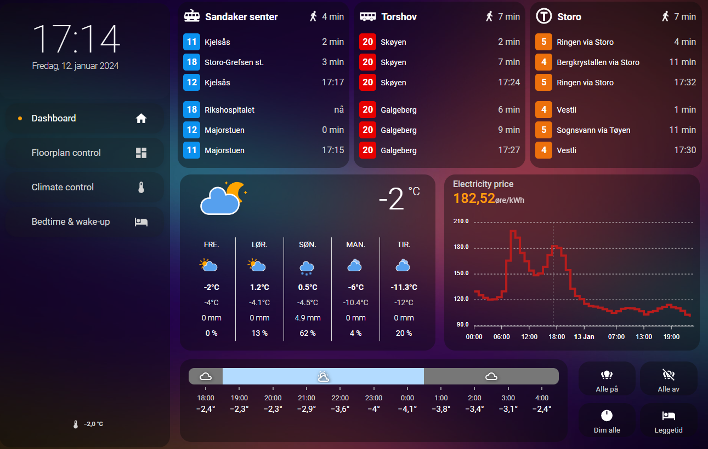

# Home Assistant // Gullburet

This repo contains (the shareable part of) my smart-home configuration. Orchestration is handled by [Home Assistant](https://www.home-assistant.io/). 

What is *Gullburet*? It's the nickname of our apartment, and it means "the gold-cage".

## Hardware

The system is compromised of many hardware devices, obviously. 

### Host system
- Raspberry Pi 4 model B 2GB
- OS: Raspbian Lite 64-bit
- Home Assistant is running as Container, in a stack with `zwave-js-ui` (previously zwave2mqtt) and `vscode` in Docker
- PSU: 5V/3A USB-C
- Storage: Kingston KC600 256GB SSD, connected to RPi with SATA-to-USB3 adapter
- Network: CAT-6 network to router
- SMLIGHT SLZB-06M (PoE Zigbee coordinator)
- USB: Aeotec Z-Stick 7 (as Z-Wave-controller)

### Networking
- Unifi Cloud Gateway Ultra
- Unifi Switch Lite 8 PoE
- Unifi U6 Pro

### Wi-Fi/Network Devices
- Heating: **Mill Heat** (panel heaters, movable floor-unit)
- Lights: **Philips Hue** (bulbs, switches, sensors)(actually Zigbee, but on its own network)
- Speakers: **Sonos** (Play:1, One, Beam)
- Robot vacuum: **Roborock** S7 Plus
- TV: **Samsung** The Frame 55"
- Tablet, wall-mounted dashboard: **Lenovo** Tab M10 FHD Plus
- **Shelly** Plug Plus S
- Tibber Pulse - Realtime apartment power consumption meter. Uses the HAN-port.

### Z-Wave Devices
- **Fibaro** Dimmer Switch 2, Switch 2
- **Heat-it** Z-TRM3 Thermostat for floor heating

### Zigbee Devices
- **IKEA** TRÅDFRI: Transformers, lightbulbs, sockets, switches
- **Aqara** Temperature & Humidity T1 sensors
- **Namron** Temperature & Humidity sensors. Wall-mounted panel heater.

#### Tips on deploying a Zigbee network

- To control the Zigbee-network, I considered: **ZHA** and **Zigbee2MQTT**. I chose Zigbee2MQTT the second time because it is compatible with more devices. [Check the compatibility list for Zigbee devices here](https://zigbee.blakadder.com/all.html).
- Choose network channel to reduce Wi-Fi interference. [This article explains overlapping channels between Wi-Fi and Zigbee](https://www.metageek.com/training/resources/zigbee-wifi-coexistence/). I use Wi-Fi channels for 6 and 11 for my guest and IoT 2.4GHz Wi-Fis respectively, so I chose Zigbee-channel 11 to be as away from these as possible. Ideally I should have regarded surrounding Wi-Fis in my apartment building... oh, well. Whoopsies.
- Connect the Zigbee coordinator with a 3m cable away from the host, as well as away from Wi-Fi APs and big metal objects.
- Add relaying devices first to the network (devices powered by wire), starting with the closest ones to the coordinator first. Then add edge devices (powered by battery) last. This enables a strong mesh-network.

## Software 

### Containers in Docker

The host system for Home Assistant incorporates the following services running as containers:
- Home Assistant Container
- VSCode
- Z-Wave JS UI
- Zigbee2MQTT
- Mosquitto

### Dashboard services
To display relevant info about life in Oslo and Norway, here are some public APIs that are being consumed:
- Entur (Ruter): Public transportation
- Met.no (Yr): Weather
- Tibber: Local electricity ratings, including fees
- Elvia: Electrical grid usage, variable and fixed price rating, including fees

### Dashboard preview

Here is how the main view of the wall-mounted tablet dashboard looks like.

### Floorplan

The Floorplan-view is built up of different layers of pre-rendered PNGs. Take a look in the `/www/floorplan`-directory of the repo to see the images. Images was created like this:
1. Download and install the free, available software, Sweet Home 3D. Also get the available furniture/interior model packages that are also available for free, that must be downloaded separately.
2. Create the 2D floor plan of the house, and place furniture to cover your desired level of fidelity.
3. In the 3D view, edit heights, depths, widths, material, shinyness, elevation, rotation and so on for furniture, walls, floors as your heart desires. Also add light sources.
4. Find a nice point of view and save it. It will serve as the POV to make all renderings from.
5. Edit environment settings, such as location and elevation of the home. This will impact sunlight in the renderings.
6. Choose a standard date and time for the renders. I use 202X-03-23, since it is in the middle between the darkest and lightest in Norway. I also use 18:30 as time for when it is getting fairly dark.
7. Turn off all light sources (edit light source and set light brightness to 0, or deactivate the light) and create the first render: A completely dark base-image of the home. The less light sources are active on in the images, the faster the renders take to generate.
8. Then go one-light at a time, adjust the light source brightness, and keep all other sources dark. Create renders of all light sources.
9. Use GIMP (free) or Photoshop, and import all images as layers.
10. Add alpha-channel to all images/layers. We will make anything that is not interesting for each image/layer transparent.
11. Crop all images into the same desired size.
12. Use Free-select tool to mark areas of each image/layer that is affected by that image light source, clearing everything else and making the other parts of image transparent.
13. Export a base, dark image and each light source as their own indpendent PNG.

## Learnings

- Displaying time-left for a `timer`-helper in the Floorplan `picture-elements` rig does not as easily as I'd hoped. Just displaying it as an entity is pointless because it updates only once every 30-40s.
- Using HA's native `conditional`-card to conditionally show certain cards (in this case the very reactive room-info column left of the Floorplan) leaves empty 12px transparent boxes if the cards are left out. This might be a weird interaction between the the `bootstrap`-card I use for laying out the columns.
- I tried configuring a `custom:swipe-card` inside another `custom:swipe-card` (it's from HACS), where I attempted to swipe between different public transportation stops horizontally, and swiping vertical at each stop would show the map of the stop. After configuring this in the most minimal and efficient way, it just kept breaking the UI even though the intended functionality worked. Implemented in a different way.
- It might be trivial to some, but the way I mentally separate concerns of *Automations* and *Scripts* is that Scripts are responsible for performing sequences that can be triggered by something explicitly defined, while Automations are more orchestrations that listen to changing/triggered entities and then run Scripts or other services.
- In Template sensor (and other related Jinja-template instances), add default-values when casting string as floats to avoid issues if the value is `unknown` for some reason. Example: `"{{ states('sensor.temperature') | float(default=0) }}"`
- The ApexCharts HACS-card is brilliant for timeseries data graphs, but does for some reason not support bar-graphs with categories (March 2024). There is support for column-timeseries, but I was unsuccessful in making discrete categories as bars. I wanted to display the entity-state of my top 3 monthly energy consumption "max-hours", and how rank between the fixed-price levels from the grid company. I instead went with a `radialBar` type chart instead.
- 2024-09-04, Core HA v2024.4.0: Changing name and entity-id for a script does not change its internally stored unique ID, so it must still be referenced by its original id.
- Tibber Pulse: Started being unresponsive and unstable after 2 months of perfect operation. Powering it with USB + PoE from HAN-port + restarting Wi-Fi router seems to make it better, but still unreliable.