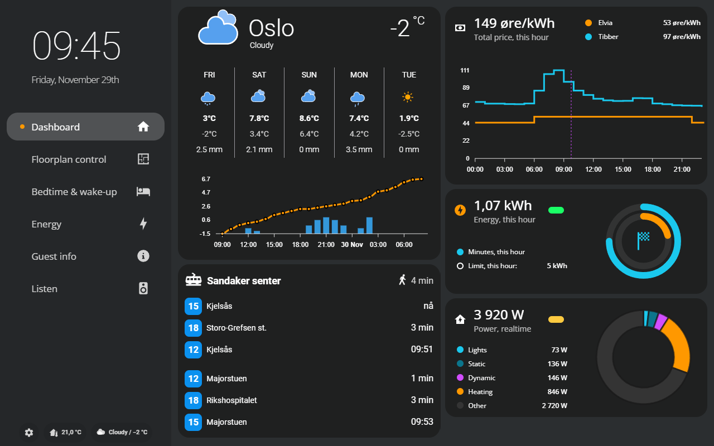
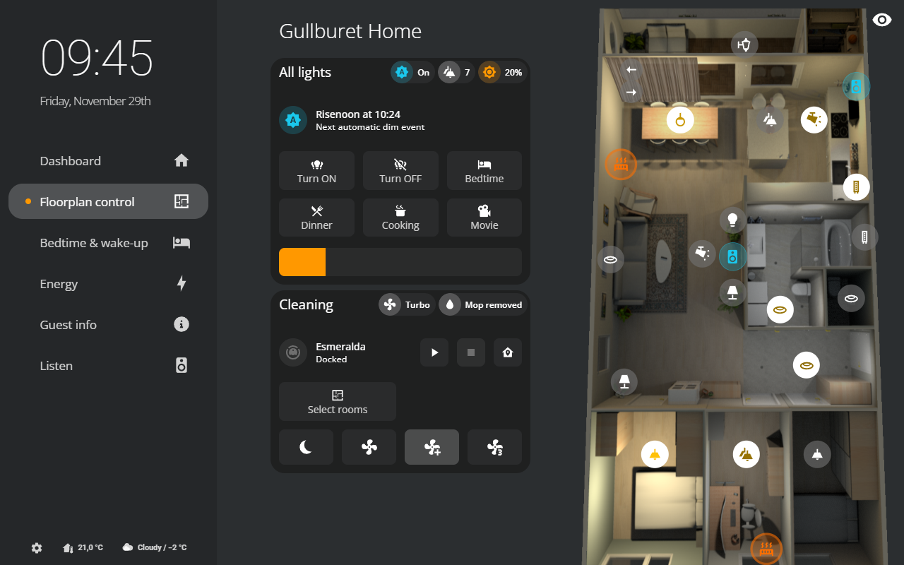
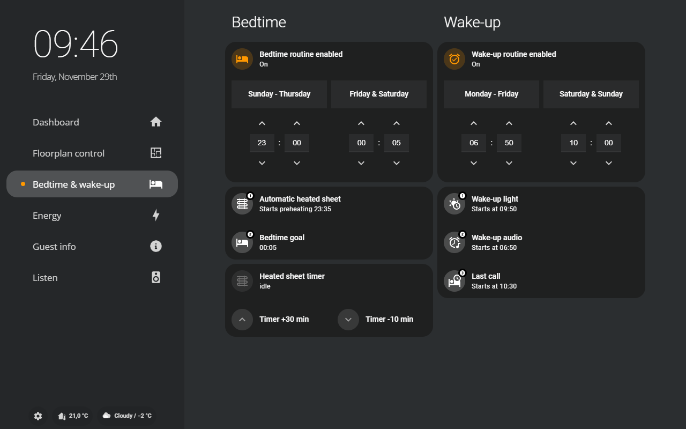
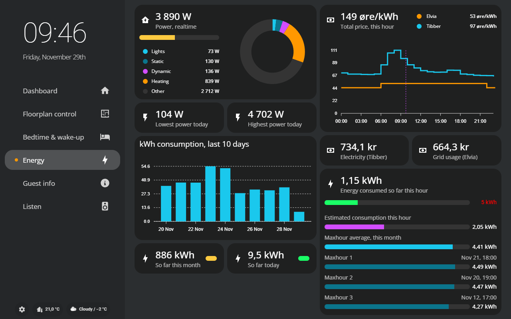
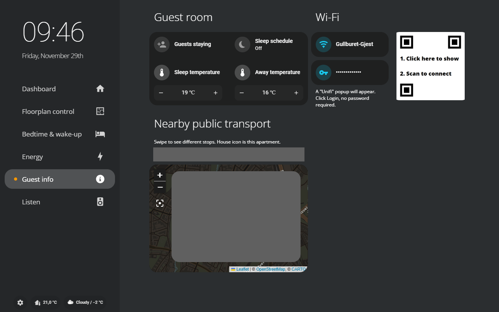
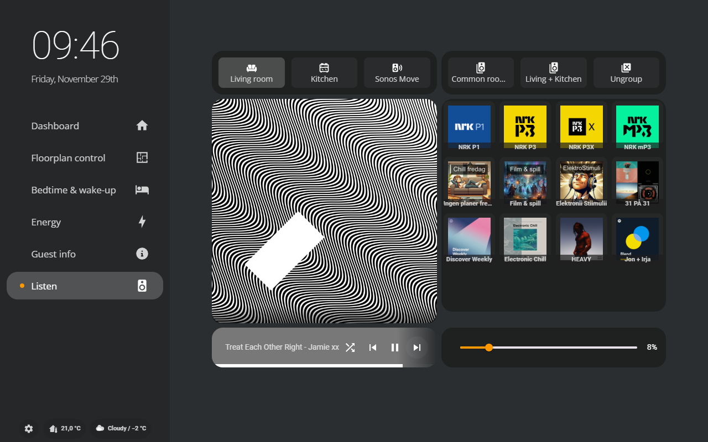

**Please STAR this project if you find it useful or interesting.**  

# Home Assistant // Gullburet

This repo contains (the shareable part of) my smart-home configuration. Orchestration is handled by [Home Assistant](https://www.home-assistant.io/). 

What is *Gullburet*? It's the nickname of our apartment, and it means "the gold-cage".

## Wall-mounted control tablet

A tablet has been wall-mounted in the entry hall to serve easy control. It reduces the need to control everything with a mobile, which is also a lot easier for guests.

The interface has been custom-made to fit the daily needs of the persons living there.

Screenshots of the different tab-views:

## Hardware

The system is compromised of many hardware devices, obviously. 

### Host system
- Raspberry Pi 4 model B 2GB
- OS: Raspbian Lite 64-bit
- Home Assistant is running as Container, in a stack with `zwave-js-ui` (previously zwave2mqtt) and `vscode` in Docker
- PSU: 5V/3A USB-C
- Storage: Kingston KC600 256GB SSD, connected to RPi with SATA-to-USB3 adapter
- Network: CAT-6 network to router
- SMLIGHT SLZB-06M (PoE Zigbee coordinator)
- USB: Aeotec Z-Stick 7 (as Z-Wave-controller)

### Networking
- Unifi Cloud Gateway Ultra
- Unifi Switch Lite 8 PoE
- Unifi U6 Pro

### Wi-Fi/Network Devices
- Heating: **Mill Heat** (panel heaters, movable floor-unit)
- Lights: **Philips Hue** (bulbs, switches, sensors)(actually Zigbee, but on its own network)
- Speakers: **Sonos** (Play:1, One, Beam)
- Robot vacuum: **Roborock** S7 Plus
- TV: **Samsung** The Frame 55"
- Tablet, wall-mounted dashboard: **Lenovo** Tab M10 FHD Plus
- **Shelly** Plug Plus S
- Tibber Pulse - Realtime apartment power consumption meter. Uses the HAN-port.

### Z-Wave Devices
- **Fibaro** Dimmer Switch 2, Switch 2
- **Heat-it** Z-TRM3 Thermostat for floor heating

### Zigbee Devices
- **IKEA** TRÅDFRI: Transformers, lightbulbs, sockets, switches
- **Aqara** Temperature & Humidity T1 sensors
- **Namron** Temperature & Humidity sensors. Wall-mounted panel heater.

## Software 

### Containers in Docker

The host system for Home Assistant incorporates the following services running as containers:
- Home Assistant Container
- VSCode
- Z-Wave JS UI
- Zigbee2MQTT
- Mosquitto

### Dashboard services
To display relevant info about life in Oslo and Norway, here are some public APIs that are being consumed:
- Entur (Ruter): Public transportation
- Met.no (Yr): Weather
- Tibber: Local electricity ratings, including fees
- Elvia: Electrical grid usage, variable and fixed price rating, including fees

#### How I made my Zigbee network more reliable

- Switched to a PoE Zigbee coordinator, to escape the previous USB-stick solution which is at the mercy reliability-wise of its host's power management - which in the case of the RPi is horrible
- Switched from **ZHA** to **Zigbee2MQTT** because it is compatible with more devices. [Check the compatibility list for Zigbee devices here](https://zigbee.blakadder.com/all.html), and it is more configurable.
- Intentionally chose a specific Zigbee-channel to reduce interference with Wi-Fi. [This article explains overlapping channels between Wi-Fi and Zigbee](https://www.metageek.com/training/resources/zigbee-wifi-coexistence/). I use Wi-Fi channels 6 and 11 for guest and IoT 2.4GHz Wi-Fis respectively, so I chose Zigbee channel 11 (equal to Wi-Fi channel 1) to be as away from these as possible. 
- Connected the Zigbee coordinator with a 3m cable away from the host, as well as away from Wi-Fi APs and big metal objects.
- Add relaying devices first to the network (devices powered by wire), starting with the closest ones to the coordinator first. Then add edge devices (powered by battery) last. This enables a strong mesh-network.

### How I made the 3D Floorplan

The Floorplan-view is built up of different layers of pre-rendered PNGs. Take a look in the `/www/floorplan`-directory of the repo to see the images. Images was created like this:
1. Download and install the free software, Sweet Home 3D. Also get the available furniture/interior model packages that are also available for free, that must be downloaded separately.
2. Create the 2D floor plan of the house, and place furniture to cover your desired level of fidelity.
3. In the 3D view, edit heights, depths, widths, material, shinyness, elevation, rotation and so on for furniture, walls, floors as your heart desires. Also add light sources.
4. Find a nice point of view and save it. It will serve as the POV to make all renderings from.
5. Edit environment settings, such as location and elevation of the home. This will impact sunlight in the renderings.
6. Choose a standard date and time for the renders. I use 202X-03-23, since it is in the middle between the darkest and lightest in Norway. I also use 18:30 as time for when it is getting fairly dark.
7. Turn off all light sources (edit light source and set light brightness to 0, or deactivate the light) and create the first render: A completely dark base-image of the home. The less light sources are active on in the images, the faster the renders take to generate.
8. Then go one-light at a time, adjust the light source brightness, and keep all other sources dark. Create renders of all light sources.
9. Use GIMP (free) or Photoshop, and import all images as layers.
10. Add alpha-channel to all images/layers. We will make anything that is not interesting for each image/layer transparent.
11. Crop all images into the same desired size.
12. Use Free-select tool to mark areas of each image/layer that is affected by that image light source, clearing everything else and making the other parts of image transparent.
13. Export a base, dark image and each light source as their own indpendent PNG.

## Credits

This project has been directly implemented by myself, but I want to extend some big, warm and grateful *thank you*s to the following resources on the internet:
- [@lukevink's HA-config on GitHub](https://github.com/lukevink/hass-config-lajv): His clean tablet-dashboard has served as a huge inspiration for my tablet UI
- [@HomeAutomationGuy on YouTube](https://www.youtube.com/@HomeAutomationGuy): Great, in-depth guides on many HA-related topics.
- [@EverythingSmartHome](https://www.youtube.com/@EverythingSmartHome): A fantastic general resource on HA-related news and topics. 
- [@My_Smart_Home on YouTube](https://www.youtube.com/@My_Smart_Home): To-the point and well-made vidoes on configuring components, down to the nitty-gritty details. Has taught me new things and provided inspiration!

